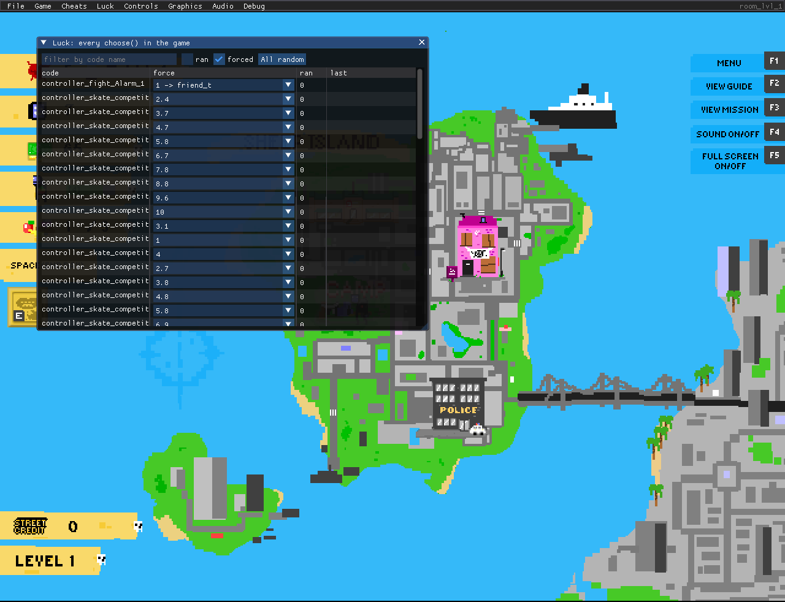

# gmrecomp: GameMaker static recompiler

gmrecomp turns a GameMaker Studio 1.4 game's `data.win` into native C. Every GML
code entry becomes its own C function. A small hand-written runtime, built on SDL2,
provides the engine: instances, events, rooms, drawing, audio and input. Nothing
interprets bytecode at run time, and the YoYo runner exe isn't used at all.

It's a sibling of [pcrecomp](https://github.com/sp00nznet/pcrecomp) and follows
the same house style for recompilation projects. pcrecomp lifts x86. A GameMaker
game's x86 is only YoYo's generic runner, and the game itself is bytecode in
`data.win`, so the bytecode is what gets lifted here.

**Generated source is not distributed.** You supply your own copy of the game;
the recompiler runs on your machine and writes C into a gitignored folder.

## Status

**v0.1.0, alpha.** One title runs from boot to gameplay:

| Game | Bytecode | Lift | Built-ins | State |
|---|---|---|---|---|
| [Urban Pirate](https://github.com/sp00nznet/urbanpirate) (2016) | 15 (GMS 1.4.1757) | 1691/1691 | 46/46 | Plays: intro, menus, levels, saves, Continue |

Conformance (current corpus): **1691/1691 code entries, 46/46 functions,
14/14 built-in variables**. See [Conformance](#conformance).

Supported: bytecode 15 (GameMaker: Studio 1.4). Only what a lifted game
calls is implemented. A missing built-in is a link error, never a silent stub.
[ROADMAP.md](ROADMAP.md) lists what's next.

## Screenshots

| | |
|---|---|
|  |  |
| The dev menu docked above a recompiled game | Luck: every `choose()` in the game, each one steerable |

## Getting Started

Most people want a game repo (for example [urbanpirate](https://github.com/sp00nznet/urbanpirate)).
Its `Setup.cmd` fetches this toolkit and does everything below. To use the
toolkit directly:

1. Install **Python 3.10+**, **Visual Studio 2022** with the C++ workload,
   and **vcpkg** at `C:\vcpkg`.
2. Install the libraries:
   ```
   C:\vcpkg\vcpkg install sdl2 sdl2-image sdl2-mixer imgui --triplet x64-windows
   ```
3. Recompile a game:
   ```
   python tools\gmrecomp.py "D:\Games\Urban Pirate\data.win" -o gen
   ```
   Expected output: `lifted 1691/1691 code entries, 46 functions used, 223 choose() sites`
4. Build it:
   ```
   powershell -File tools\build.ps1 -Gen gen -Out bin\game.exe
   ```
   Expected output ends with `built ...\bin\game.exe`.
5. Run it and point it at the game's folder (it reads textures and sounds
   from `data.win`):
   ```
   bin\game.exe --game "D:\Games\Urban Pirate"
   ```

Usual trip-ups: `python` opening the Microsoft Store means the Store alias is
on; use `py` or turn the alias off. vcpkg libraries installed for `x86` won't
link; the triplet must be `x64-windows`.

## Usage

```
game.exe --game DIR                      run windowed with the dev menu
game.exe --game DIR --headless --frames 900 --record out.mp4
game.exe --game DIR --headless --keys 1000:37,1030:13 --shot 1100:menu.png
game.exe --game DIR --headless --ui --click 1600:120,10 --shot 1610:menu.png
game.exe --game DIR --load state0.gms --seed 42
```

- `--headless` renders offscreen with the software renderer and opens no
  visible window, so it works over RDP. `--record` pipes frames to ffmpeg.
- `--keys F:VK[:HOLD]` taps a GameMaker virtual key at frame F (13 Enter,
  37-40 arrows, 32 Space).
- `--ui` renders the dev menu into headless captures too, and `--click F:X,Y`
  clicks it. The screenshots above were taken this way.
- `--seed` fixes the RNG, and `--room N` starts in room N.

Tools:

```
python tools\gmdis.py data.win [name]        bytecode listing
python tools\gmdis.py --gml data.win [name]  readable pseudo-GML
python tools\conformance.py                  conformance harness
```

The listings are derived from the game. Write them to a gitignored folder such
as `scratch\`.

## Dev menu

Every build has an ImGui menu bar above the game, similar to the Tachyon and
SimCity 2000 frontends:

| Menu | What it does |
|---|---|
| File | 10 savestate slots (F6 / F7 quick save and load). |
| Game | Pause (F8), frame step (F9), speed 0.25x-8x, hold Tab for 4x, restart room, go to any room. |
| *(game)* | The game repo's own cheats (its profile). |
| Luck | Every `choose()` in the game, labelled with what each outcome creates, forced or left random. |
| Controls | Extra keys for any game key, gamepad mapping (left stick works as the d-pad). The mouse clicks the game's own buttons (each becomes its key), otherwise Enter / Esc. |
| Graphics / Audio | Window scale, smoothing, fullscreen; effects and music volume, mute. |
| Debug | Every global (edit, freeze), every instance (inspect, edit, destroy), collision boxes. |

How it reaches the game's state and how profiles plug in:
[docs/devmenu.md](docs/devmenu.md).

## Building from source

`tools/build.ps1` compiles the generated C, `runtime/*.c` and the dev menu
with MSVC (`/O2 /MD`) and links against SDL2, SDL2_image, SDL2_mixer and
imgui from vcpkg. `-NoMenu` builds without ImGui, and `-Extra DIR` adds a game
repo's profile sources. Full notes: [docs/building.md](docs/building.md).

## Conformance

`tools/conformance.py` lifts every code entry of every `data.win` in the
corpus and checks the runtime has every function and built-in variable they
use. The corpus is your own games, listed in `conformance/corpus.txt`
(gitignored) or `GMRECOMP_CORPUS`. With no corpus it prints `SKIP` and passes.
Counts are compared with `conformance/baseline.json`, and any drop fails.

```
Urban Pirate             code 1691/1691  functions 46/46  builtin vars 14/14
TOTAL: 1 games, code 1691/1691, functions 46/46, builtin vars 14/14
```

## Docs

- [docs/architecture.md](docs/architecture.md): the parts and the data flow
- [docs/format.md](docs/format.md): the `data.win` chunks and bytecode 15 encoding
- [docs/recompiler.md](docs/recompiler.md): how bytecode becomes C
- [docs/runtime.md](docs/runtime.md): event order, instances, the deliberate gaps
- [docs/devmenu.md](docs/devmenu.md): the menu, luck, profiles
- [docs/building.md](docs/building.md): toolchain and build details

## License

MIT, see [LICENSE](LICENSE). The vendored Dear ImGui SDL2 backends are MIT
(Omar Cornut), see [NOTICE](NOTICE).
